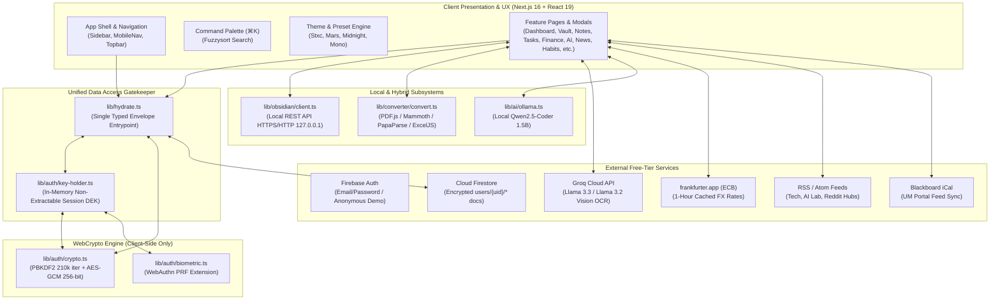
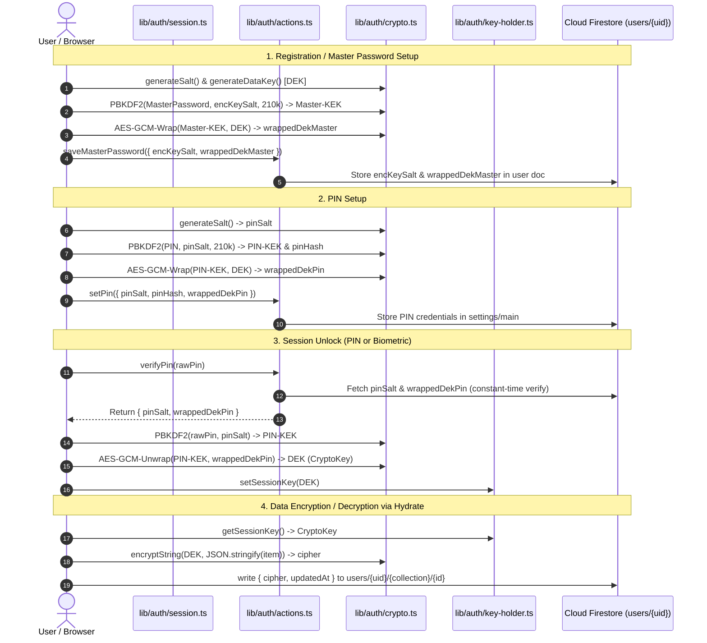
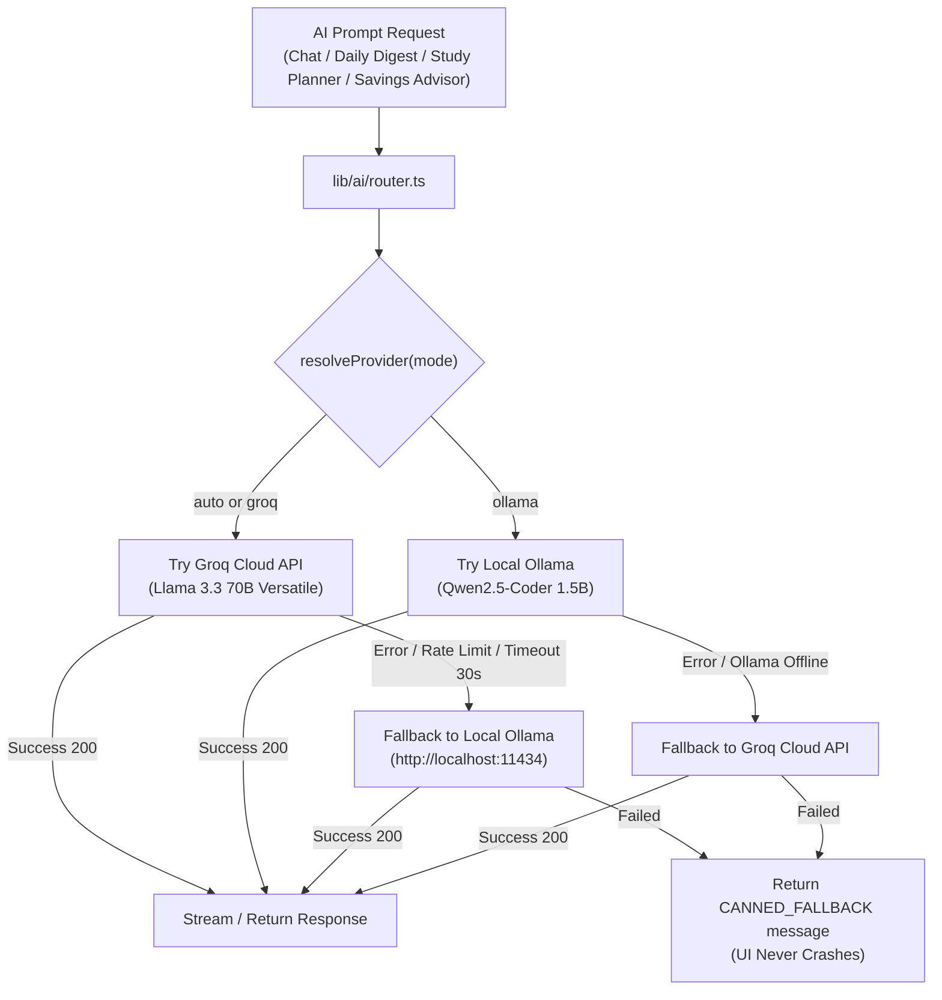
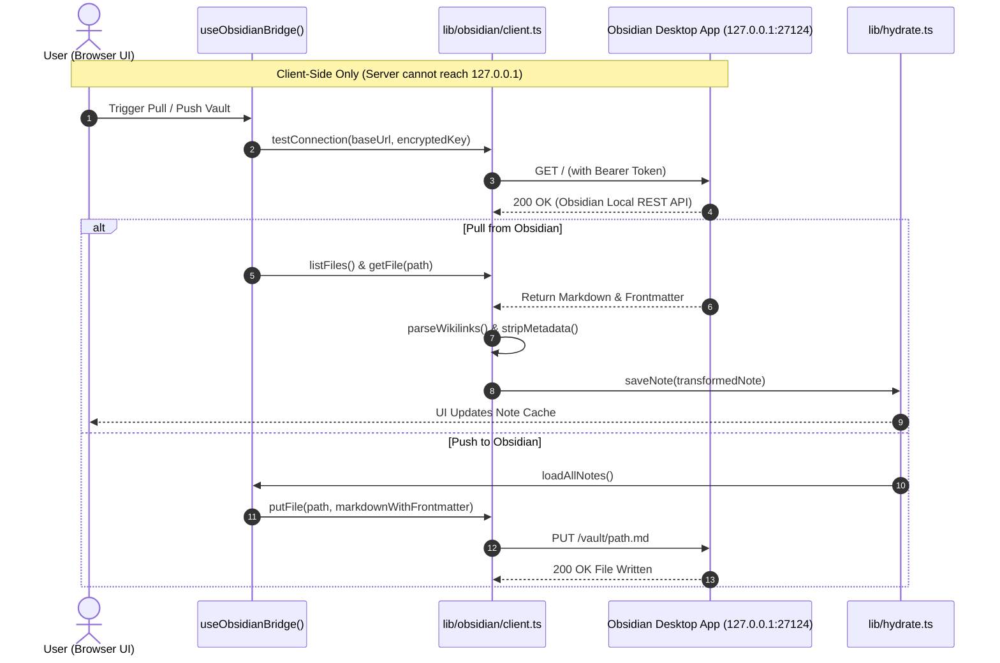
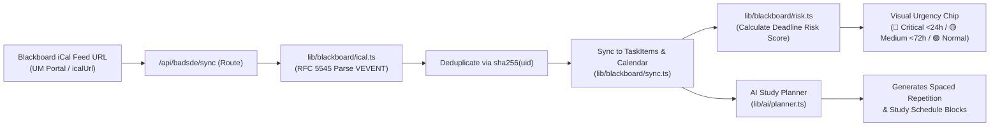

# Stxic OS — Master Architecture & Code Tree Reference

> **Purpose:** This reference document provides an authoritative, complete architectural map, subsystem breakdown, cryptographic model, and code tree for **Stxic (Personal Life OS)**. It is structured to minimize hallucinations, preserve context across sessions, and establish strict boundaries between modules.

---

## 1. System Architecture & Core Invariants

Stxic is a privacy-first, zero-cost, open-source **Personal Life OS** built with **Next.js 16 (App Router)**, **React 19**, **Tailwind CSS 4**, **WebCrypto (AES-GCM / PBKDF2)**, **Firebase Auth & Firestore**, and **Capacitor 8 (Android)**.



### Core Architecture Invariants
1. **Zero Plaintext at Rest:** All sensitive user data (`vault`, `notes`, `tasks`, `transactions`, `accounts`, `savingsGoals`, `habits`, `focusSessions`) is encrypted client-side via AES-GCM 256-bit with an ephemeral, non-extractable Data Encryption Key (DEK) before being stored in Firestore.
2. **Single Data Gatekeeper (`lib/hydrate.ts`):** Components and features **never** invoke Firestore SDK methods directly. All data access flows through `lib/hydrate.ts` and returns a typed `Envelope<T>`.
3. **Session-Locked State:** When locked (or when auto-lock expires), `key-holder.ts` purges the DEK from memory. Hydrate calls to encrypted collections instantly fail-safe with `{ ok: false, error: "Session locked" }`.
4. **Obsidian Local-Only Constraint:** The Next.js server cannot route requests to `127.0.0.1`. Therefore, Obsidian Live Hybrid sync is strictly client-side via `lib/obsidian/client.ts`.
5. **Zero Paid APIs / Free Tier Invariant:** Groq free tier, local Ollama, frankfurter.app (ECB), and direct RSS parsing. No subscription services or paid APIs.

---

## 2. Cryptographic Key Derivation & Auth Flow



---

## 3. Master Code Tree Diagram

```
c:/Users/Sebaz/stxic/
├── .env.example                          # Canonical environment variable reference
├── .env.local                            # Local development secrets & emulator toggles
├── .firebaserc                           # Firebase CLI project binding (demo-stxic)
├── .gitattributes / .gitignore           # Git ignore & attribute definitions
├── .prettierrc.json / .prettierignore   # Formatting configuration (Tailwind plugin)
├── AGENTS.md                             # Next.js agent rule enforcement block
├── capacitor.config.ts                   # Capacitor 8 Android runtime configuration
├── CONTRIBUTING.md                       # Open-source contribution guidelines
├── eslint.config.mjs                     # ESLint 9 flat configuration with next core-web-vitals
├── firebase.json                         # Firebase hosting, firestore, and emulator ports
├── firestore.rules                       # Security rules (own-uid access + demo sandbox)
├── firestore.indexes.json                # Single-field indexing rules (no composite indexes required)
├── next.config.ts                        # Next.js 16 compiler configuration
├── package.json                          # Dependencies & NPM scripts
├── postcss.config.mjs                    # PostCSS with @tailwindcss/postcss
├── proxy.ts                              # Next 16 edge proxy login guard (middleware)
├── README.md                             # Project overview, quickstart & scripts
├── tsconfig.json                         # Strict TypeScript compiler options
├── vitest.config.mts                     # Unit testing configuration (Vitest 4)
├── vitest.rules.config.mts               # Firestore emulator rules testing configuration
│
├── android/                              # Capacitor 8 Native Android Platform Shell
│   ├── app/                              # Android application project source
│   │   ├── build.gradle                  # App-level Gradle build configuration
│   │   ├── google-services.json          # Firebase Android app registration
│   │   └── src/main/
│   │       ├── AndroidManifest.xml       # Native permissions (Internet, Biometric, Push)
│   │       ├── java/com/stxic/os/
│   │       │   └── MainActivity.java     # Bridge entrypoint Activity
│   │       └── res/                      # Android launcher icons, splash screens, XML config
│   ├── build.gradle                      # Top-level Android build script
│   └── variables.gradle                  # Android SDK version mappings
│
├── app/                                  # Next.js 16 App Router Routes & Handlers
│   ├── layout.tsx                        # Root layout (Inter font, ThemeProvider, Toaster)
│   ├── page.tsx                          # Root entrypoint (redirects to /dashboard or /login)
│   ├── icon.png                          # App favicon/icon
│   │
│   ├── (auth)/                           # Unauthenticated Route Group
│   │   ├── login/page.tsx                # Email/password authentication & Demo entry
│   │   └── pin/page.tsx                  # PIN verification pad & WebAuthn biometric unlock
│   │
│   ├── (app)/                            # Authenticated Life OS Route Group (gated by AppShell)
│   │   ├── layout.tsx                    # Protected App layout (AuthProvider, AppShell, CommandPalette)
│   │   ├── dashboard/page.tsx            # Central dashboard (Widgets grid, AI digest, Stats)
│   │   ├── vault/page.tsx                # Password manager (AES-GCM encrypted, generator, audit)
│   │   ├── notes/page.tsx                # Markdown editor (Autosave, Wikilinks, Obsidian bridge)
│   │   ├── tasks/page.tsx                # Kanban board, P0-P2 priorities, Calendar, BADS-DE sync
│   │   ├── income/page.tsx               # Unified Finance (Income/Expense ledger, Accounts, Savings)
│   │   ├── focus/page.tsx                # Pomodoro focus timer, logging & weekly analytics
│   │   ├── ai/page.tsx                   # Dual AI chat (Groq Llama 3.3 / Ollama Qwen2.5)
│   │   ├── study/page.tsx                # AI study planner & exam schedule generator
│   │   ├── semester/page.tsx             # Academic term course grid & syllabus planner
│   │   ├── news/page.tsx                 # Tech/AI RSS news aggregator, TL;DR & Save to Notes
│   │   ├── convert/page.tsx              # Client-side file-to-text converter & OCR
│   │   ├── habits/page.tsx               # Habit streak tracker & completion matrix
│   │   └── settings/page.tsx             # Theme presets, PIN/Biometrics, Obsidian sync, Backups
│   │
│   ├── p/                                # Note Web Publishing (Public Note Pages)
│   │   └── [slug]/                       # Public view for shared/published notes
│   │
│   └── api/                              # Next.js API Routes & External Integration Handlers
│       ├── ai/chat/route.ts              # AI streaming chat API route (SSE)
│       ├── auth/verify-pin/route.ts      # Server-side PIN verification endpoint
│       ├── backup/
│       │   ├── export/route.ts           # Backup manifest export endpoint
│       │   └── restore/route.ts          # Backup restore validator endpoint
│       ├── badsde/
│       │   ├── sync/route.ts             # Blackboard UM iCal feed fetcher & parser
│       │   └── draft/route.ts            # Assignment email / study draft generator
│       ├── convert/file/route.ts         # Server-side file conversion stub
│       ├── focus/session/route.ts        # Focus session logger stub
│       ├── fx/rate/route.ts              # Frankfurter ECB currency rate proxy with 1h cache
│       ├── news/
│       │   ├── route.ts                  # RSS feed aggregate fetcher
│       │   └── saved/route.ts            # Saved article fetcher
│       ├── notify/route.ts               # Push notification dispatch handler
│       ├── ocr/route.ts                  # Groq Vision OCR endpoint for scanned docs
│       └── firebase-messaging-sw.js/
│           └── route.ts                  # Dynamic FCM service worker route
│
├── components/                           # React UI Primitives & Domain Feature Modules
│   ├── auth/                             # Authentication & Session Components
│   │   ├── auth-provider.tsx             # Client AuthContext (user, session, locked state)
│   │   └── pin-pad.tsx                   # Interactive touch/keyboard PIN pad
│   ├── brand/
│   │   └── brand-mark.tsx                # Stxic OS visual SVG logo & wordmark
│   ├── command/                          # Global Command Palette (⌘K)
│   │   ├── command-palette.tsx           # Modal palette dialog with keyboard shortcuts
│   │   └── providers.tsx                 # Context actions & command registry
│   ├── layout/                           # Responsive Shell & Navigation Components
│   │   ├── app-shell.tsx                 # Main layout wrapper (Desktop sidebar + Mobile navbar)
│   │   ├── nav-items.ts                  # Canonical navigation routes & feature flag mappings
│   │   ├── sidebar.tsx                   # Desktop collapsible navigation rail
│   │   ├── mobile-nav.tsx                # Mobile bottom navigation bar + sheet
│   │   └── topbar.tsx                    # Top header with Breadcrumbs, Lock & Command trigger
│   ├── theme/                            # Theming & Visual Presets
│   │   ├── theme-provider.tsx            # CSS variable injection (accent, radius, surface)
│   │   └── theme-toggle.tsx              # Dark/Light mode toggle switch
│   ├── ui/                               # Design System Primitives (Tailwind + Radix UI)
│   │   ├── badge.tsx                     # Status, priority & category badges
│   │   ├── button.tsx                    # Accessible button variants (cva)
│   │   ├── card.tsx                      # Glassmorphic / Solid content containers
│   │   ├── dialog.tsx                    # Radix Dialog wrapper
│   │   ├── empty-state.tsx               # Empty list illustrations & action triggers
│   │   ├── input.tsx                     # Styled input fields
│   │   ├── kbd.tsx                       # Keyboard key shortcut indicators
│   │   ├── label.tsx                     # Form labels
│   │   ├── progress-ring.tsx             # SVG circular progress indicators
│   │   ├── select.tsx                    # Radix Select dropdowns
│   │   ├── skeleton.tsx                  # Loading shimmer placeholders
│   │   ├── switch.tsx                    # Radix Switch toggles
│   │   ├── tabs.tsx                      # Radix Tabs container
│   │   ├── textarea.tsx                  # Auto-growing textareas
│   │   ├── toast.tsx / toaster.tsx       # Radix Toast notification system
│   │   ├── tooltip.tsx                   # Radix Tooltip components
│   │   └── index.ts                      # Barrel export for UI primitives
│   └── features/                         # Isolated Domain Feature Components
│       ├── auth/
│       │   └── biometric-card.tsx        # WebAuthn fingerprint/face unlock card
│       ├── backup/
│       │   └── backup-card.tsx           # .stxbak export & encrypted restore card
│       ├── clocks/
│       │   └── world-clocks.tsx          # Multi-timezone world clock display
│       ├── dashboard/
│       │   ├── digest-card.tsx           # AI morning briefing / daily digest
│       │   ├── grid.tsx                  # Responsive 12-column dashboard layout
│       │   └── widget-body.tsx           # Widget dispatcher for dashboard cards
│       ├── fx/
│       │   └── fx-converter.tsx          # Real-time USD/PHP/EUR currency converter
│       ├── income/                       # Finance Tracker Feature Module
│       │   ├── account-dialog.tsx        # Bank/Card account creation modal
│       │   ├── finance-assistant.tsx     # AI financial advisor & savings suggestions
│       │   ├── finance-chart.tsx         # Recharts Income vs Expenses monthly breakdown
│       │   ├── savings-dialog.tsx        # Savings goal target modal
│       │   └── transaction-dialog.tsx    # Income/Expense transaction entry modal
│       ├── notes/
│       │   ├── markdown-preview.tsx      # Markdown parser with Wikilinks syntax support
│       │   └── note-editor.tsx           # Markdown editor with autosave & word stats
│       ├── obsidian/                     # Obsidian Live Hybrid & Graph Module
│       │   ├── obsidian-graph.tsx        # Interactive canvas note connection graph
│       │   ├── obsidian-settings-card.tsx# Local REST API connection & token settings
│       │   ├── use-obsidian-bridge.ts    # React hook for live Push/Pull vault sync
│       │   └── vault-browser.tsx         # Obsidian desktop folder & file browser
│       ├── push/
│       │   └── push-card.tsx             # Web & native push notification settings
│       ├── tasks/                        # Task & Academic Feature Module
│       │   ├── blackboard-panel.tsx      # UM Blackboard iCal feed sync & risk badges
│       │   ├── calendar-view.tsx         # Calendar deadline grid
│       │   ├── kanban-board.tsx          # dnd-kit drag-and-drop Task Kanban columns
│       │   ├── priority-badge.tsx        # P0/P1/P2 visual priority chips
│       │   ├── task-card.tsx             # Draggable task item card
│       │   └── task-dialog.tsx           # Task creation & editing dialog
│       └── vault/                        # Secure Credentials Vault Module
│           ├── password-generator.tsx    # Entropy-configurable password generator
│           ├── password-strength.tsx     # Zxcvbn-style strength meter & entropy calculator
│           └── vault-item-dialog.tsx     # Secure credential create/edit dialog
│
├── lib/                                  # Core Domain Logic, Cryptography & Integrations
│   ├── clocks.ts                         # World clocks timezone list & calculation helpers
│   ├── finance.ts                        # Finance ledger calculations, net worth, CSV import/export
│   ├── focus.ts                          # Pomodoro timer interval & session math
│   ├── fx.ts                             # Currency conversion & rate caching logic
│   ├── generator.ts                      # Secure cryptographic password generator
│   ├── habits.ts                         # Habit streak computation & log management
│   ├── hydrate.ts                        # Central typed Firestore read/write/encrypt gatekeeper
│   ├── notes.ts                          # Note manipulation, folder aggregation & search
│   ├── semester.ts                       # Semester GPA, credit hours & course schedule logic
│   ├── strength.ts                       # Password strength scoring & common vulnerability audit
│   ├── tasks.ts                          # Task sorting, Kanban column filtering & status updates
│   ├── theme.ts                          # Theme preset registries (Stxc, Mars, Midnight, Mono)
│   ├── vault.ts                          # Vault folder/tag aggregation & search helpers
│   │
│   ├── ai/                               # AI Engine (Groq Cloud + Ollama Local Fallback)
│   │   ├── actions.ts                    # Server Actions for AI operations
│   │   ├── client.ts                     # AI client execution helpers
│   │   ├── config.ts                     # Model registry & provider resolution logic
│   │   ├── digest.ts                     # Daily digest aggregator (tasks, finance, news)
│   │   ├── groq.ts                       # Groq Cloud API SDK wrapper (Llama 3.3 70B)
│   │   ├── ocr.ts                        # Groq Vision OCR parser for scanned PDFs & images
│   │   ├── ollama.ts                     # Ollama Local API wrapper (Qwen2.5-Coder 1.5B)
│   │   ├── planner.ts                    # Academic study plan generation engine
│   │   ├── prompts.ts                    # Centralized prompt templates
│   │   ├── router.ts                     # Dual provider router with graceful fallback
│   │   ├── savings.ts                    # AI financial savings advisor logic
│   │   └── types.ts                      # AI message, model & streaming types
│   │
│   ├── auth/                             # Authentication, Session & Cryptographic Layer
│   │   ├── actions.ts                    # Next.js Server Actions (session cookies, PIN verification)
│   │   ├── biometric.ts                  # WebAuthn PRF extension biometric enrollment & unlock
│   │   ├── crypto.ts                     # WebCrypto PBKDF2, AES-GCM wrapping & decrypt/encrypt
│   │   ├── key-holder.ts                 # Ephemeral in-memory DEK storage & auto-lock timer
│   │   └── session.ts                    # Session cookie token helpers
│   │
│   ├── backup/                           # Encrypted Backup & Restore Subsystem
│   │   ├── export.ts                     # AES-GCM encrypted .stxbak package generation
│   │   ├── format.ts                     # Backup payload schema validator
│   │   └── restore.ts                    # Decrypt, validate, and restore .stxbak archives
│   │
│   ├── blackboard/                       # BADS-DE Student Automation Engine
│   │   ├── drafts.ts                     # Assignment email & extension draft templates
│   │   ├── ical.ts                       # RFC 5545 iCalendar feed parser
│   │   ├── risk.ts                       # Deadline risk engine (Calculates urgency & score)
│   │   └── sync.ts                       # Blackboard events to Stxic Task synchronization
│   │
│   ├── config/                           # Application Feature Flags
│   │   └── features.ts                   # Feature flag catalog & runtime gating functions
│   │
│   ├── converter/                        # Client-Side Document & File Converter
│   │   ├── convert.ts                    # Format conversion orchestrator (PDF, DOCX, XLSX, CSV)
│   │   ├── formats.ts                    # Supported MIME types & format detectors
│   │   └── note.ts                       # Converted file text to Markdown Note generator
│   │   ├── ocr.ts                        # Client-side OCR pipeline helper
│   │
│   ├── dashboard/                        # Dashboard Grid & Widget Logic
│   │   ├── grid.ts                       # Grid layout position & collision calculator
│   │   └── widgets.ts                    # Widget registry & default layout presets
│   │
│   ├── demo/                             # Guest & Demo Sandbox Environment
│   │   └── seed.ts                       # Realistic mock data generator (vault, finance, tasks)
│   │
│   ├── firebase/                         # Firebase SDK Configuration
│   │   ├── admin.ts                      # Firebase Admin SDK (Server Actions & Verify Token)
│   │   └── client.ts                     # Firebase Client SDK (Auth & Firestore client instances)
│   │
│   ├── news/                             # Curated Tech & AI RSS News Hub
│   │   ├── fetchers.ts                   # Parallel RSS feed fetcher with timeout
│   │   ├── note.ts                       # Article to Markdown Note formatter
│   │   ├── rss.ts                        # XML/Atom RSS feed parser
│   │   ├── sources.ts                    # Default RSS feed registry (HackerNews, arXiv, AI Labs)
│   │   ├── summarizer.ts                 # Article TL;DR extractive summarizer
│   │   └── types.ts                      # Feed, Item, and Category types
│   │
│   ├── obsidian/                         # Obsidian Live Hybrid & Sync Subsystem
│   │   ├── client.ts                     # Local REST API client (HTTPS self-signed & HTTP fallback)
│   │   ├── export.ts                     # Stxic Notes to Obsidian Markdown ZIP exporter
│   │   ├── format.ts                     # YAML Frontmatter & Wikilinks transformer
│   │   ├── graph.ts                      # Note connection & link graph builder
│   │   ├── sync.ts                       # Two-way push/pull reconciliation engine
│   │   └── wikilinks.ts                  # [[Note Name]] parser and resolver
│   │
│   ├── publish/                          # Web Publishing Subsystem (/p/[slug])
│   │   ├── actions.ts                    # Note publication Server Actions
│   │   └── shared.ts                     # Public note slug generator & read helpers
│   │
│   ├── push/                             # Push Notification Dispatcher
│   │   ├── messaging.ts                  # Firebase Cloud Messaging (FCM) Web client
│   │   └── notify.ts                     # Notification payload creator & scheduler
│   │
│   └── utils/                            # Shared Utilities
│       ├── cn.ts                         # Tailwind CSS class merger (clsx + tailwind-merge)
│       ├── csv.ts                        # CSV parser and exporter
│       ├── currency.ts                   # Multi-currency formatter & symbol helper
│       ├── dates.ts                      # Date formatting & relative time calculation
│       ├── index.ts                      # Utility barrel exports
│       └── timers.ts                     # Debounce, throttle, and interval timer helpers
│
├── types/
│   └── index.ts                          # Master TypeScript domain model & contract
│
├── docs/                                 # Architecture, Agent Specifications & Roadmaps
│   ├── AGENT_AI.md                       # AI specifications (Groq, Ollama, Study Planner)
│   ├── AGENT_API_ORCHESTRATION.md        # API routes, envelope contract, proxy rules
│   ├── AGENT_AUTH_DB.md                  # Auth & Database ownership & collection layout
│   ├── AGENT_BACKUP_DEMO.md              # .stxbak format & Demo sandbox specifications
│   ├── AGENT_BADS_DE.md                  # Blackboard sync & deadline risk engine docs
│   ├── AGENT_CORE_FEATURES.md            # Vault, Notes, Tasks, Finance specs
│   ├── AGENT_EXTRAS.md                   # Converter, Habits, Semester planner specs
│   ├── AGENT_NEWS_X.md                   # RSS news hub specifications
│   ├── AGENT_OBSIDIAN_HYBRID.md          # Obsidian Live REST API & hybrid sync docs
│   ├── AGENT_UI_DESIGN.md                # UI design, presets & accessibility specs
│   ├── AGENT_UI_SKILL.md                 # UI craft standards & anti-slop guidelines
│   ├── API.md                            # Comprehensive API route catalog & statuses
│   ├── badsde.md                         # BADS-DE original specification
│   ├── BUILD_APK.md                      # Step-by-step Capacitor Android build manual
│   ├── OBSIDIAN_SETUP.md                 # Obsidian Local REST API setup & cert trust guide
│   ├── PROJECT_CONTEXT_MASTER.md         # Stxic project master context & rules
│   ├── ROADMAP.md                        # Master project checklist & milestones
│   └── ARCHITECTURE_CODE_TREE.md         # This master architecture and code tree document
│
├── public/                               # Static Assets & PWA Service Worker
│   ├── manifest.webmanifest              # PWA web app manifest
│   ├── sw.js                             # Offline caching service worker
│   └── icon-192.png / icon-512.png       # PWA home screen icons
│
├── scripts/
│   └── generate-icons.mjs                # SVG to PNG PWA icon generator script
│
├── styles/
│   └── globals.css                       # Tailwind CSS 4 setup, theme variables & animations
│
└── tests/                                # Vitest Unit & Integration Test Suites
    ├── ai-actions.test.ts                # AI action execution tests
    ├── ai-savings.test.ts                # AI financial advisor tests
    ├── ai.test.ts                        # Dual provider router & fallback tests
    ├── backup.test.ts                    # Encrypted .stxbak export & restore tests
    ├── clocks.test.ts                    # World clocks calculations tests
    ├── converter.test.ts                 # Document text extraction tests
    ├── crypto.test.ts                    # WebCrypto PBKDF2 & AES-GCM tests
    ├── dashboard.test.ts                 # Widget grid math & layout tests
    ├── demo.test.ts                      # Demo seed integrity tests
    ├── digest.test.ts                    # Daily digest synthesis tests
    ├── finance.test.ts                   # Finance calculations & CSV export tests
    ├── focus.test.ts                     # Pomodoro interval calculation tests
    ├── fx.test.ts                        # Frankfurter FX caching & conversion tests
    ├── generator.test.ts                 # Password entropy generator tests
    ├── habits.test.ts                    # Habit streak computation tests
    ├── news.test.ts                      # RSS parser & summarizer tests
    ├── notes.test.ts                     # Note manipulation & tag index tests
    ├── obsidian-client.test.ts           # Obsidian Local REST API client tests
    ├── obsidian-format.test.ts           # Wikilinks & Frontmatter transformer tests
    ├── obsidian-graph.test.ts            # Note connection graph builder tests
    ├── obsidian-sync.test.ts             # Obsidian reconciliation sync tests
    ├── ocr.test.ts                       # Vision OCR parser tests
    ├── planner.test.ts                   # Study planner schedule generator tests
    ├── publish.test.ts                   # Note web publishing slug tests
    ├── rules.test.ts                     # Firestore security rules unit tests (emulators)
    ├── semester.test.ts                  # Semester GPA & term grid tests
    ├── tasks.test.ts                     # Task sorting & Kanban filter tests
    ├── theme.test.ts                     # Theme preset resolution tests
    ├── timers.test.ts                    # Utility timer tests
    ├── vault.test.ts                     # Vault search & folder aggregation tests
    ├── blackboard/
    │   ├── ical.test.ts                  # RFC 5545 iCalendar parser tests
    │   └── risk.test.ts                  # Deadline risk engine scoring tests
```

---

## 4. Subsystem & Module Matrix

| Domain Subsystem | Core File(s) | Primary Responsibility | Data Storage / Hydration | Feature Flag Gate |
| :--- | :--- | :--- | :--- | :--- |
| **Auth & Security** | `lib/auth/crypto.ts`<br/>`lib/auth/key-holder.ts`<br/>`lib/auth/actions.ts` | PBKDF2 key derivation, AES-GCM wrapping, session cookies, PIN & Biometric unlock | `users/{uid}` (profile, salts, wrapped keys) | `auth`, `biometric` |
| **Data Hydration** | `lib/hydrate.ts` | Centralized, typed, client-side encryption/decryption bridge for all Firestore docs | All Firestore collections | Always Active |
| **Credentials Vault** | `lib/vault.ts`<br/>`lib/generator.ts`<br/>`lib/strength.ts` | Password storage, entropy generator, password strength scoring & reused credential audit | `users/{uid}/vault/{id}` (Encrypted) | `vault` |
| **Notes & Publishing** | `lib/notes.ts`<br/>`lib/publish/actions.ts` | Markdown notes, folder trees, Wikilinks rendering, public web publishing (`/p/[slug]`) | `users/{uid}/notes/{id}` (Encrypted) | `notes`, `publish` |
| **Tasks & Kanban** | `lib/tasks.ts`<br/>`components/features/tasks/kanban-board.tsx` | P0-P2 task priorities, dnd-kit Kanban drag-drop, calendar deadline schedule | `users/{uid}/tasks/{id}` (Encrypted) | `tasks` |
| **Academic BADS-DE** | `lib/blackboard/ical.ts`<br/>`lib/blackboard/risk.ts`<br/>`lib/blackboard/sync.ts` | Blackboard UM iCal feed parsing, deadline risk scoring, task & calendar sync | `users/{uid}/blackboard` | `badsde` |
| **Finance Tracker** | `lib/finance.ts`<br/>`components/features/income/*` | Unified Income/Expense ledger, bank/card account balances, savings goals, CSV export | `users/{uid}/transactions`, `accounts`, `savingsGoals` (Encrypted) | `income` |
| **AI Intelligence** | `lib/ai/router.ts`<br/>`lib/ai/groq.ts`<br/>`lib/ai/ollama.ts`<br/>`lib/ai/digest.ts` | Groq Llama 3.3 + Ollama Qwen2.5 fallback, Daily Digest synthesis, study planner, OCR | In-memory stream / Dashboard widget | `ai`, `studyPlanner`, `ocr` |
| **Obsidian Live Hybrid** | `lib/obsidian/client.ts`<br/>`lib/obsidian/sync.ts`<br/>`lib/obsidian/graph.ts` | Direct HTTPS/HTTP bridge to desktop Obsidian Local REST API (`127.0.0.1`), Push/Pull sync, interactive graph | Local Desktop Vault + `users/{uid}/notes` | `obsidian`, `obsidianLive` |
| **News & Tech Hub** | `lib/news/rss.ts`<br/>`lib/news/summarizer.ts` | Multi-feed RSS/Atom aggregator (HackerNews, arXiv, AI Labs), TL;DR summarizer, Save to Notes | `users/{uid}/newsConfig` | `news`, `readingList` |
| **Document Converter** | `lib/converter/convert.ts` | Client-side text extraction for PDF, DOCX, XLSX, CSV, HTML, TXT (Web Workers) | In-memory client conversion | `convert` |
| **Habits & Focus** | `lib/habits.ts`<br/>`lib/focus.ts` | Daily habit streak tracker, Pomodoro focus timer, session duration logging | `users/{uid}/habits`, `focusSessions` (Encrypted) | `habits`, `focus` |
| **Backup & Demo** | `lib/backup/export.ts`<br/>`lib/backup/restore.ts`<br/>`lib/demo/seed.ts` | Encrypted `.stxbak` archive export/import; Sandboxed anonymous demo mode | Client download / `users/{uid}/demo` | `backup`, `demo` |
| **UI & Theming** | `lib/theme.ts`<br/>`components/command/command-palette.tsx` | Theme presets (Stxc, Mars, Midnight, Mono), dynamic accent picker, global ⌘K palette | `users/{uid}/settings` | `presets` |

---

## 5. Subsystem Deep-Dive Workflows

### 5.1 AI Dual-Provider Routing Flow



### 5.2 Obsidian Live Hybrid Synchronization Flow



### 5.3 BADS-DE Academic Deadline & Risk Workflow



---

## 6. Firestore Database Architecture & Security Rules

### Collection Schema Hierarchy
```
users/
└── {uid}/                          # Document: UserProfile (Salt, Wrapped DEK, Master KEK metadata)
    ├── settings/
    │   └── main                    # Document: UserSettings (PIN hash, theme, currency, obsidian config)
    ├── newsConfig/
    │   └── main                    # Document: NewsConfig (RSS sources, saved IDs, reading list)
    ├── blackboard/
    │   └── feed                    # Document: BlackboardFeed (Cached events, mirrored hashes, last sync)
    ├── fxCache/
    │   └── {pair}                  # Document: FxCache (USD_PHP, EUR_PHP, 1-hour expiration)
    ├── demo/
    │   └── state                   # Document: Sandboxed demo configuration
    │
    │── [ENCRYPTED SUBCOLLECTIONS] ──────────────────────────────────────────
    │   (Stored as: { cipher: "base64_iv.ciphertext", updatedAt: number })
    ├── vault/{id}                  # VaultItem (credentials, passwords, notes)
    ├── notes/{id}                  # Note (markdown body, tags, folders, publishing status)
    ├── tasks/{id}                  # TaskItem (kanban status, priority, dueDate, calendarId)
    ├── transactions/{id}           # Transaction (unified income/expense ledger)
    ├── accounts/{id}               # FinanceAccount (manual bank/card balances)
    ├── savingsGoals/{id}           # SavingsGoal (target, saved amount, deadline)
    ├── habits/{id}                 # Habit (daily check-in record, streak count)
    └── focusSessions/{id}          # FocusSession (pomodoro logs, duration seconds)
```

### Security Rules Contract (`firestore.rules`)
- **Default Deny-All:** Any access to non-authenticated paths or unmatched subcollections is rejected.
- **Strict Own-UID Matching:** `request.auth.uid == userId` is enforced on every read, write, update, and delete operation.
- **Document Isolation:** No user can enumerate, query, or observe documents outside their own `users/{userId}` subtree.
- **Demo Namespace Sandbox:** Anonymous demo users are restricted to their sandboxed partition with write limitations.

---

## 7. Developer & Agent Cheat Sheet (Anti-Hallucination Rules)

> [!IMPORTANT]
> Keep these five critical constraints in mind when writing or modifying code in Stxic:

1. **Next.js 16 Edge Proxy (Not `middleware.ts`):**
   - Next.js 16 uses `proxy.ts` for route interception and login guarding. Do **not** create or look for `middleware.ts`.
2. **Never Call Firestore Directly from Components:**
   - Always import and call functions from `lib/hydrate.ts`.
   - Check the returned envelope: `if (!res.ok) { /* handle error / locked session */ }`.
3. **Obsidian Sync Must Be Client-Side:**
   - Never write a server route or server action to interact with `127.0.0.1`. The user's browser must execute the REST calls via `lib/obsidian/client.ts`.
4. **Finance Tracker Ledger Model:**
   - Modern transactions live in `transactions` (`type: "income" | "expense"`).
   - `IncomeEntry` in `users/{uid}/income` is legacy only and retained exclusively for one-time migrations and `.stxbak` backwards compatibility.
5. **No Composite Indexes Required:**
   - Queries in `hydrate.ts` are scoped to own-uid subcollections and limited using `limit(READ_LIMIT)`. Do not introduce complex multi-field inequalities that break the single-field index contract.

---

## 8. Verification & Test Suite Reference

All functionality is backed by an automated Vitest test suite. Run tests using:

| Test Script | Target & Scope | Config File |
| :--- | :--- | :--- |
| `npm test` | Cryptography, Utilities, AI Router, Finance, Notes, Vault, Obsidian | `vitest.config.mts` |
| `npm run test:rules` | Firestore Security Rules unit testing against local Firebase emulators | `vitest.rules.config.mts` |
| `npm run typecheck` | Strict TypeScript type checking across all routes and components | `tsconfig.json` |
| `npm run lint` | ESLint 9 Next.js core web vitals check | `eslint.config.mjs` |

### Key Test Suite Files
- 🔒 **Crypto & Auth:** `tests/crypto.test.ts` & `tests/rules.test.ts`
- 🧠 **AI & Router:** `tests/ai.test.ts`, `tests/ai-actions.test.ts`, `tests/planner.test.ts`
- 💎 **Obsidian Hybrid:** `tests/obsidian-client.test.ts`, `tests/obsidian-format.test.ts`, `tests/obsidian-sync.test.ts`, `tests/obsidian-graph.test.ts`
- 🎓 **BADS-DE:** `tests/blackboard/ical.test.ts` & `tests/blackboard/risk.test.ts`
- 💵 **Finance & FX:** `tests/finance.test.ts` & `tests/fx.test.ts`
- 📦 **Backup & Demo:** `tests/backup.test.ts` & `tests/demo.test.ts`
